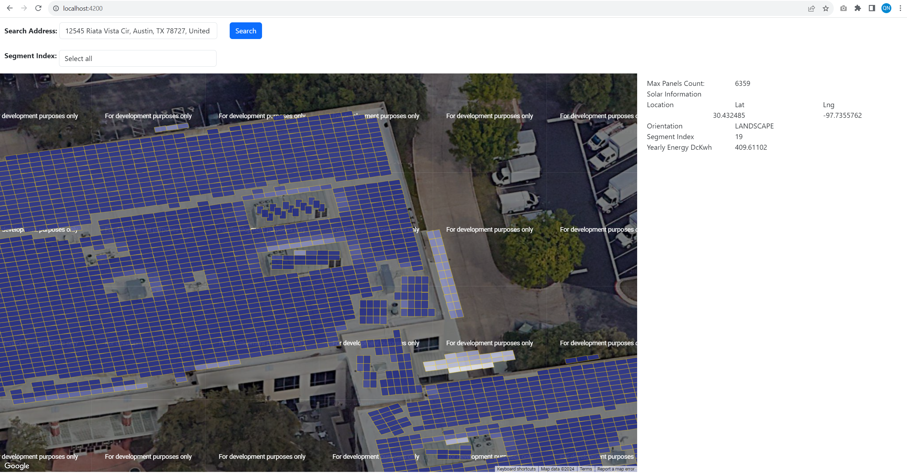

# Solarpoint

This project is a simple demonstration showing the simple features of the Google Solar API.

## Install node_modules

Run `npm i` to install node_modules. 

## Add Google API Key
Need to add the restriction for API Key:
- Solar API
- Maps JavaScript API
- Geolocation API
- Geocoding API

Then 
- add API KEY to `index.html`
```
 <script>
    (g=>{var h,a,k,p="The Google Maps JavaScript API",c="google",l="importLibrary",q="__ib__",m=document,b=window;b=b[c]||(b[c]={});var d=b.maps||(b.maps={}),r=new Set,e=new URLSearchParams,u=()=>h||(h=new Promise(async(f,n)=>{await (a=m.createElement("script"));e.set("libraries",[...r]+"");for(k in g)e.set(k.replace(/[A-Z]/g,t=>"_"+t[0].toLowerCase()),g[k]);e.set("callback",c+".maps."+q);a.src=`https://maps.${c}apis.com/maps/api/js?`+e;d[q]=f;a.onerror=()=>h=n(Error(p+" could not load."));a.nonce=m.querySelector("script[nonce]")?.nonce||"";m.head.append(a)}));d[l]?console.warn(p+" only loads once. Ignoring:",g):d[l]=(f,...n)=>r.add(f)&&u().then(()=>d[l](f,...n))})({
      v: "weekly",
      key: "GOOGLE_API_KEY"
    });
  </script>
```
- add API KEY to `environment.development.ts` or `environment.production.ts` 


## Development server

Run `ng serve` for a dev server. Navigate to `http://localhost:4200/`. The application will automatically reload if you change any of the source files.

## Test on UI

Try input an address: `12545 Riata Vista Cir, Austin, TX 78727, United States`

